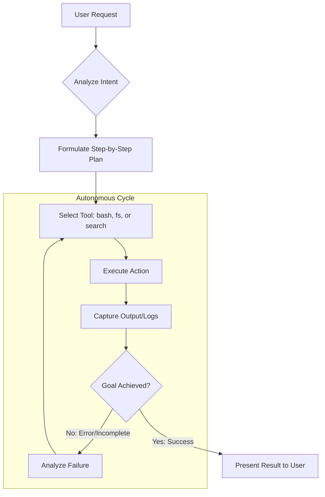
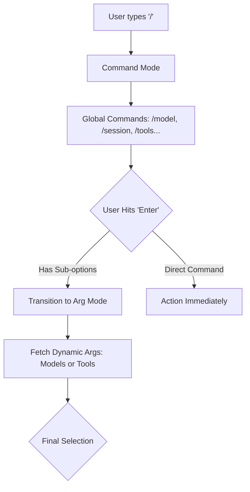

# 🚀 tiny-cli

A powerful, lightweight agentic AI coding assistant that supports any model via OpenAI-compatible APIs. `tiny-cli` transforms your terminal into an autonomous workspace where AI can research, plan, and execute coding tasks with full context awareness and persistent sessions.

> [!TIP]
> `tiny-cli` is a powerful yet lightweight CLI designed for universal model support, delivering frontier-grade agentic capabilities through any OpenAI-compatible endpoint.

---

## 🌟 Key Features

- **🤖 Autonomous Agent Mode**: A sophisticated execution loop that cycles through *Research* → *Plan* → *Act* → *Verify*.
- **🔌 MCP Client Integration**: Built-in support for the [Model Context Protocol (MCP)](https://modelcontextprotocol.io). Background connections don't block the REPL.
- **🧠 Smart Context Management**: Automatic memory compaction handles long-running sessions (35k token trigger).
- **📎 File Mentions (`@filename`)**: Instant context injection with fuzzy-search.
- **🛡️ Permission-Based Execution**: Secure execution with configurable modes (`notify`, `auto-edit`, `auto`).
- **📜 Hierarchical Slash Commands**: Nested command engine for managing sessions, models, and tools.
- **🔧 Configurable Logging**: Log levels (`TRACE`, `DEBUG`, `LOG`, `ERROR`) via `agents.json`.
- **⏱️ Request Timeout**: Built-in timeout (default: 120s) prevents indefinite hangs on stalled model requests.

---

## 🏗 Deep Dive: Agent Architecture

`tiny-cli` operates on a robust agentic loop designed for high-fidelity task execution. Unlike simple chat interfaces, it uses a state-driven approach to ensure every action is verified.

### The Agentic Cycle
The agent follows this loop until the user-defined goal is met:



### Execution Modes
- **Agent Mode (`/agent`)**: The agent has full permission to read, write, and execute. It is optimized for building features and fixing bugs.
- **Chat Mode (`/chat`)**: Conversational mode for discussion and Q&A.
- **Plan Mode (`/plan`)**: A read-only sandbox where the agent focuses on architectural research and strategy without altering your codebase. Plans can be executed via `/continue`.

---

## ⌨️ Deep Dive: Command System

### Slash Commands (`/`)
Slash commands use a "Selection-to-Submenu" pattern, allowing for complex configurations without leaving the terminal.



| Command | Description |
|:---|:---|
| `/agent` | Switch to autonomous agent mode |
| `/chat` | Switch to conversational chat mode |
| `/plan` | Switch to planning mode |
| `/model` | Select a different LLM model |
| `/tools` | List available tools |
| `/mcp` | Manage MCP server connections |
| `/session` | List/Load/New conversation sessions |
| `/mode` | Switch permission mode (`notify`, `auto-edit`, `auto`) |
| `/continue` | Continue executing the active plan |
| `/clear` | Clear conversation history |
| `/exit` | Save session and quit |

### File Mention System (`@`)
Typing `@` triggers a high-performance workspace indexer.
- **Fuzzy Search**: Instantly filters files across your entire project.
- **Context Hydration**: Selected files are read and injected into the agent's context window as a reference, ensuring the AI "sees" exactly what you are referring to.

---

## 🔌 Deep Dive: MCP Integration

`tiny-cli` is a first-class **MCP Host**. It implements the Model Context Protocol to allow for infinite extensibility.

- **Tool Discovery**: Automatically lists and registers tools from connected MCP servers.
- **Background Connections**: MCP servers connect in the background so the REPL is never blocked during startup. Connection status is logged after each prompt.
- **Transport Support**: Supports both `stdio` (local processes) and `http` (remote HTTP/SSE) transports.

To manage servers, use the `/mcp` command to list, connect, or disconnect servers in real-time.

---

## 🧠 Deep Dive: Context & Memory

To prevent "hallucination" and performance degradation in long sessions, `tiny-cli` implements **Memory Compaction**.

1.  **Threshold Detection**: When the session exceeds **35,000 tokens**.
2.  **Context Analysis**: The agent identifies "stale" conversation segments that are no longer relevant to the current task.
3.  **Summarization**: Old segments are summarized into high-density "Memory Notes," while the most recent **10,000 tokens** are kept in raw form.
4.  **Preservation**: System prompts and critical project context are never summarized.

---

## 🛠 Installation

```bash
# Clone the repository
git clone https://github.com/sadaigm/tiny-cli.git
cd tiny-cli

# Install dependencies
pnpm install

# Build the project
pnpm build

# Link globally (optional)
cd packages/cli
pnpm link --global
```

### Docker

```bash
docker build -t tiny-cli .

# Must run with -it for interactive TTY
docker run -it tiny-cli
```

---

## 📖 Usage

### Interactive REPL

```bash
tiny-cli                           # Start interactive REPL (default: agent mode)
tiny-cli --mode plan               # Start REPL in plan mode
```

### Headless (Single Query)

```bash
tiny-cli "build a web app"                    # Run a single task and exit
tiny-cli -q "draft an architecture" -m plan   # Headless plan mode
tiny-cli --resume <session-id>                # Resume a previous session
```

---

## ⚙️ Configuration

Configured via `.tiny-cli/agents.json` (project-local) or `~/.tiny-cli/agents.json` (global).

### Full Configuration Example

```json
{
  "name": "default",
  "model": "llama3.2:latest",
  "description": "Default local assistant (Ollama)",
  "temperature": 0.7,
  "systemPrompt": "...",
  "permissionMode": "notify",
  "logLevel": "LOG",
  "maxIterations": 50,
  "environment": {
    "hostUrl": "http://localhost:11434",
    "appBasePath": "/v1",
    "apiKey": "...",
    "insecure": true
  },
  "mcpServers": [
    {
      "name": "my-remote-tools",
      "type": "http",
      "url": "http://localhost:3001/mcp"
    },
    {
      "name": "local-tools",
      "type": "stdio",
      "command": "npx",
      "args": ["my-mcp-server"]
    }
  ]
}
```

### Configuration Fields

| Field | Description | Default |
|:---|:---|:---|
| `model` | Model identifier (e.g. `llama3.2:latest`) | `llama3.2:latest` |
| `temperature` | Sampling temperature | `0.7` |
| `systemPrompt` | Override the default system prompt | Built-in default |
| `permissionMode` | `notify` (ask), `auto-edit` (auto files, ask bash), `auto` (no prompts) | `notify` |
| `logLevel` | `TRACE`, `DEBUG`, `LOG`, `ERROR` | `LOG` |
| `maxIterations` | Max agent loop iterations per query | Unlimited |
| `environment.hostUrl` | Model API base URL | `http://localhost:11434` |
| `environment.appBasePath` | API path prefix | `/v1` |
| `environment.apiKey` | API key for authenticated endpoints | `none` |
| `environment.insecure` | Skip TLS verification | `false` |
| `mcpServers` | Array of MCP server configs | `[]` |

### Log Levels

| Level | Shows |
|:---|:---|
| `TRACE` | Everything (request/response tracing, internal state) |
| `DEBUG` | DEBUG, LOG, ERROR |
| `LOG` | Normal output and errors (default) |
| `ERROR` | Errors only |

---

## 🏗 Project Structure

- `packages/core`: Core agent engine, model client, tool registry, MCP manager, and logger.
- `packages/cli`: Interactive REPL, command handlers, and file mention system.

## 📄 License

Apache-2.0
