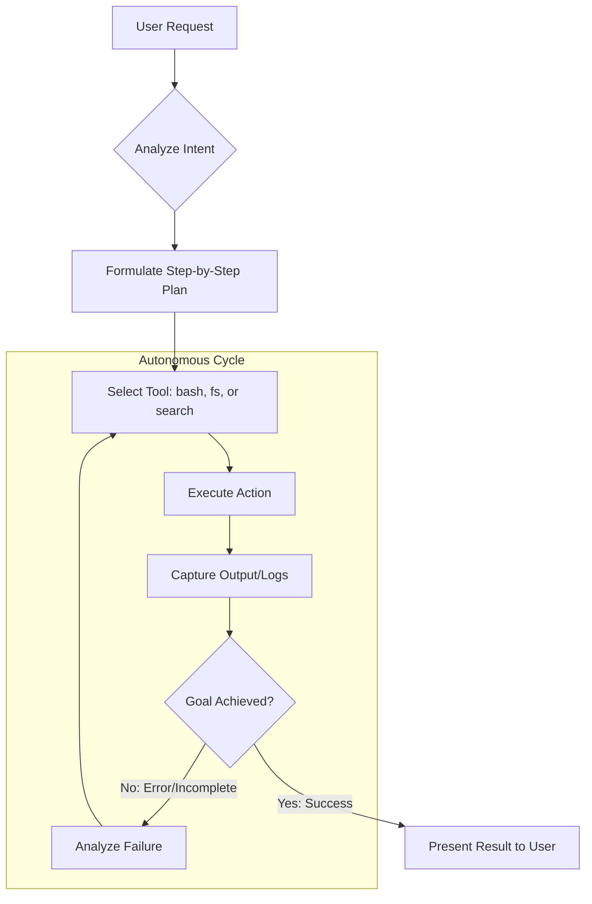
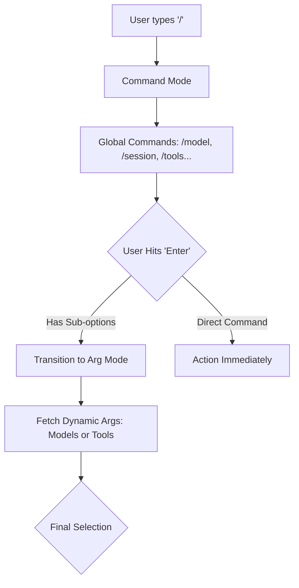

# 🚀 tiny-cli

A powerful, lightweight agentic AI coding assistant that supports any model via OpenAI-compatible APIs. `tiny-cli` transforms your terminal into an autonomous workspace where AI can research, plan, and execute coding tasks with full context awareness and persistent sessions.

> [!TIP]
> `tiny-cli` is a powerful yet lightweight CLI designed for universal model support, delivering frontier-grade agentic capabilities through any OpenAI-compatible endpoint.

---

## 🌟 Key Features

- **🤖 Autonomous Agent Mode**: A sophisticated execution loop that cycles through *Research* → *Plan* → *Act* → *Verify*.
- **🔌 MCP Client Integration**: Built-in support for the [Model Context Protocol (MCP)](https://modelcontextprotocol.io).
- **🧠 Smart Context Management**: Automatic memory compaction handles long-running sessions (35k token trigger).
- **📎 File Mentions (`@filename`)**: Instant context injection with fuzzy-search.
- **🛡️ Permission-Based Execution**: Secure execution with prompts for sensitive operations.
- **📜 Hierarchical Slash Commands**: Nested command engine for managing sessions, models, and tools.

---

## 🏗 Deep Dive: Agent Architecture

`tiny-cli` operates on a robust agentic loop designed for high-fidelity task execution. Unlike simple chat interfaces, it uses a state-driven approach to ensure every action is verified.

### The Agentic Cycle
The agent follows this loop until the user-defined goal is met:



### Execution vs. Planning Mode
- **Execution Mode (`/chat`)**: The agent has full permission to read, write, and execute. It is optimized for building features and fixing bugs.
- **Planning Mode (`/plan`)**: A read-only sandbox where the agent focuses on architectural research and strategy without altering your codebase.

---

## ⌨️ Deep Dive: Command System

The CLI uses a unique **Hierarchical Command System** that distinguishes between global actions, file context, and tool management.

### Slash Commands (`/`)
Slash commands use a "Selection-to-Submenu" pattern, allowing for complex configurations without leaving the terminal.



### File Mention System (`@`)
Typing `@` triggers a high-performance workspace indexer. 
- **Fuzzy Search**: Instantly filters files across your entire project.
- **Context Hydration**: Selected files are read and injected into the agent's context window as a reference, ensuring the AI "sees" exactly what you are referring to.

---

## 🔌 Deep Dive: MCP Integration

`tiny-cli` is a first-class **MCP Host**. It implements the Model Context Protocol to allow for infinite extensibility.

- **Tool Discovery**: Automatically lists and registers tools from connected MCP servers.
- **Dynamic Resource Access**: Allows agents to read from external data sources (DBs, APIs, Logs) exposed via MCP.
- **Transport Support**: Supports both `stdio` (local processes) and `sse` (remote HTTP) transports.

To manage servers, use the `/mcp` command to list, connect, or disconnect servers in real-time.

---

## 🧠 Deep Dive: Context & Memory

To prevent "hallucination" and performance degradation in long sessions, `tiny-cli` implements **Memory Compaction**.

1.  **Threshold Detection**: When the session exceeds **35,000 tokens**.
2.  **Context Analysis**: The agent identifies "stale" conversation segments that are no longer relevant to the current task.
3.  **Summarization**: Old segments are summarized into high-density "Memory Notes," while the most recent **10,000 tokens** are kept in raw form.
4.  **Preservation**: System prompts and critical project context are never summarized.

---

## 🛠 Installation

```bash
# Clone the repository
git clone https://github.com/sadaigm/tiny-cli.git
cd tiny-cli

# Install dependencies
pnpm install

# Build the project
pnpm build

# Link globally (optional)
cd packages/cli
pnpm link --global
```

## 📖 Usage

```bash
tiny-cli
```

### 🎮 Quick Commands

| Command | Description |
|:---|:---|
| `/chat` | Switch to Autonomous Agent mode (Default) |
| `/plan` | Switch to Planning mode |
| `/tools` | List and toggle available tools |
| `/mcp` | Manage MCP server connections |
| `/session` | List/Load/New conversation sessions |
| `/clear` | Clear conversation history |
| `exit` | Save session and quit |

## ⚙️ Configuration

Configured via `.tiny-cli/agents.json` or `~/.tiny-cli/agents.json`.

```json
{
  "name": "default",
  "model": "llama3.2:latest",
  "environment": {
    "hostUrl": "http://localhost:11434",
    "appBasePath": "/v1"
  }
}
```

## 🏗 Project Structure

- `packages/core`: Core agent engine, model clients, and tool registry.
- `packages/cli`: Interactive REPL and UI.

## 📄 License

Apache-2.0 © [sadaigm](https://github.com/sadaigm)
